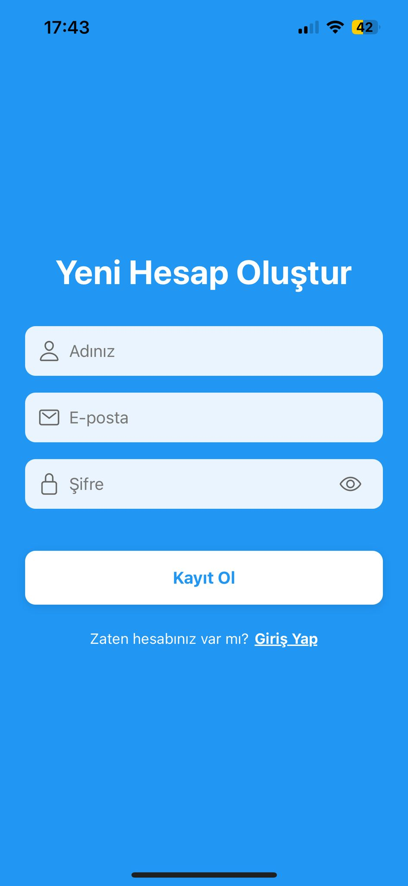
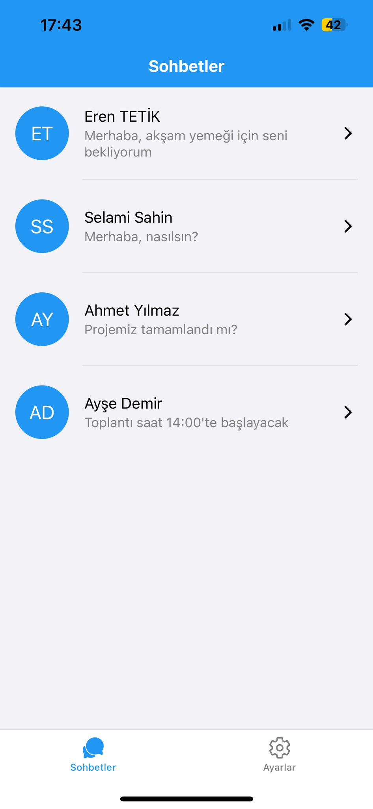
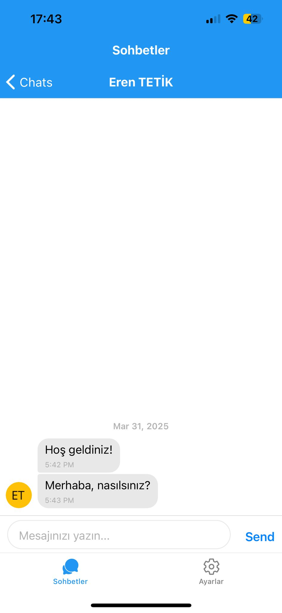
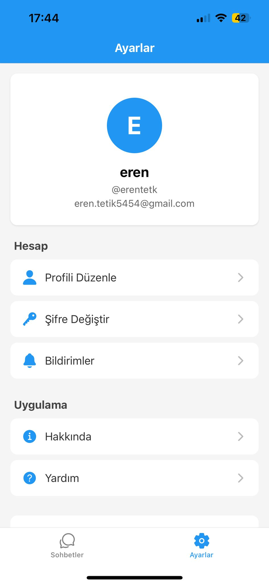

# Chattci

Chattci, modern arayüzü ve kullanıcı dostu özellikleriyle öne çıkan bir mesajlaşma uygulamasıdır.

## 📱 Ekran Görüntüleri

<div align="center" style="display: flex; flex-wrap: wrap; justify-content: center;">
  <div style="display: inline-block; margin: 10px;">
    
    <p align="center"><em>Giriş Ekranı</em></p>
  </div>
  <div style="display: inline-block; margin: 10px;">
    
    <p align="center"><em>Giriş Ekranı</em></p>
  </div>
  <div style="display: inline-block; margin: 10px;">
    
    <p align="center"><em>Sohbetler Listesi</em></p>
  </div>
  <div style="display: inline-block; margin: 10px;">
    
    <p align="center"><em>Profil Düzenleme</em></p>
  </div>
  <div style="display: inline-block; margin: 10px;">
    
    <p align="center"><em>Ayarlar Ekranı</em></p>
  </div>
</div>

## 🚀 Özellikler

- Hızlı ve güvenli mesajlaşma
- Kullanıcı dostu arayüz
- Profil düzenleme seçenekleri
- Sohbet listesi yönetimi
- Kişiselleştirilebilir ayarlar

## 🛠️ Teknolojiler

- **Frontend**: React Native, JavaScript
- **Geliştirme Ortamı**: Expo
- **UI Bileşenleri**: Custom Components
- **Navigation**: React Navigation
- **State Yönetimi**: React Hooks
- **Stil**: StyleSheet API
- **İletişim**: Fetch API / Axios

## 🔧 Kurulum

Projeyi yerel makinenizde çalıştırmak için:

```bash
# Repository'yi klonlayın
git clone https://github.com/erentetk/Chattci.git

# Proje dizinine gidin
cd Chattci

# Gerekli paketleri yükleyin
npm install
# veya
yarn install

# .env.example dosyasını kopyalayarak .env oluşturun
cp .env.example .env

# .env dosyasını kendi Supabase bilgilerinizle güncelleyin
# SUPABASE_URL ve SUPABASE_KEY değerlerini düzenleyin

# Uygulamayı başlatın
npm start
# veya
yarn start
```

## 📝 Kullanım

Uygulama başlatıldıktan sonra, QR kodunu Expo Go uygulamasıyla tarayarak mobil cihazınızda çalıştırabilir veya iOS/Android emülatörleri üzerinde test edebilirsiniz.

## 🤝 Katkıda Bulunma

Katkılarınızı memnuniyetle karşılıyoruz! Projeye katkıda bulunmak için lütfen bir pull request açın.

## 📜 Lisans

Bu proje [MIT Lisansı](LICENSE) altında lisanslanmıştır.

## 📞 İletişim

Sorularınız veya önerileriniz için lütfen iletişime geçin:

- GitHub: [@erentetk](https://github.com/erentetk)# Chattci
